# CRUD App Простое приложение - Summer_practice_2023


CRUD - это аббревиатура, пришедшая из мира компьютерного программирования и обозначающая четыре функции, которые считаются необходимыми для реализации приложения постоянного хранения: создание, чтение, обновление и удаление.

### 1. login 


### 2. registration 


### 3. CRUD USERS
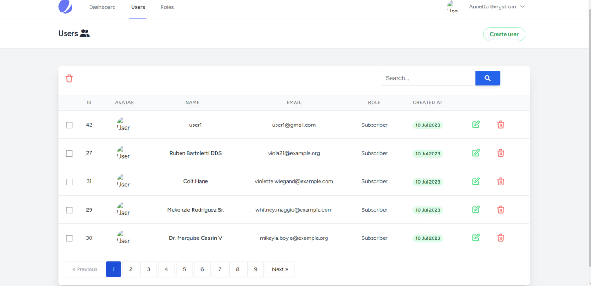

### 4. CRUD ROLES
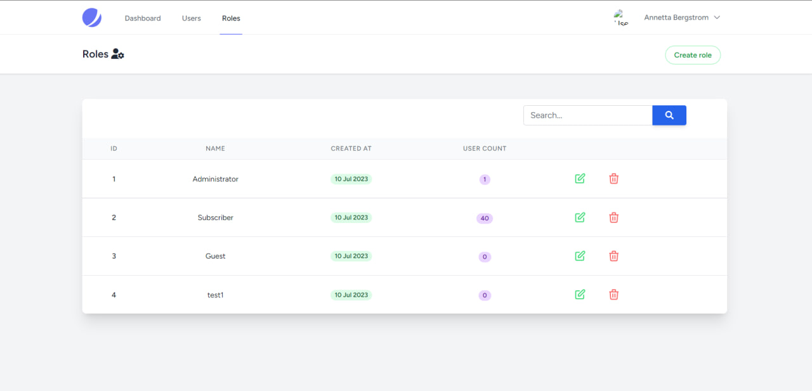


<details>
 <summary><h2>Содержимое для использования</h2></summary>

- Laravel v10
- php 8
- Docker
- Docker compose
- vue js
- Inertiajs
- MySQL 
- prometheus
- mysql exporter
- Grafana 

</details>

 Prometheus - это система с открытым исходным кодом для мониторинга и оповещения. Он разработан для сбора временных рядов данных (метрик) с различных источников, анализа их и предоставления информации о состоянии системы и производительности.

 MySQL Exporter - это экспортер для Prometheus, который собирает метрики и статистику из базы данных MySQL. Он предоставляет информацию о состоянии сервера MySQL, производительности запросов и использовании ресурсов.

 Grafana - это платформа визуализации данных и аналитики с открытым исходным кодом. Она предоставляет гибкие возможности для создания красивых дашбордов и графиков на основе различных источников данных, включая Prometheus, Elasticsearch, InfluxDB, MySQL и многие другие.


 <details>
 <summary><h2>Шаги, которые я сделал для этого проекта</h2></summary>


     
1. route metrics for the prometheus endpoint

```bash
Route::middleware([RequestsMiddleware::class])->group(function () {
    Route::get('/metrics',[MyMetricsController::class, 'myMetrics']);
});

Route::middleware(['auth:sanctum', config('jetstream.auth_session'), 'verified'])->group(function () {
    Route::resource('/users', UserController::class);
    Route::resource('/roles', RoleController::class);
});

```


2. In class MyMetricsController hava myMetrics function 
```bash
public function myMetrics(Request $request)
    {
        DB::connection()->enableQueryLog();
        $collectorRegistry = app(CollectorRegistry::class);

        // CPU usage metric
        $cpuUsage = sys_getloadavg()[0]; // Retrieves the average system load for the last minute
        $gauge = $collectorRegistry->getOrRegisterGauge(
            'spa',
            'cpu_usage_percentage',
            'CPU usage percentage'
        );
        $gauge->set($cpuUsage);

        //memory usage metric
        $memoryUsage = memory_get_usage(true);
        $gauge = $collectorRegistry->getOrRegisterGauge(
            'spa',
            'memory_usage_bytes',
            'Memory usage in bytes'
        );
        $gauge->set($memoryUsage);

        // Count the number of registered users
        $usersRegistered = User::count();
        $gauge = $collectorRegistry->getOrRegisterGauge(
            'spa',
            'users_registered_total',
            'Total number of registered users'
        );
        $gauge->set($usersRegistered);


        // Count the number of registered roles
        $usersRegistered = Role::count();
        $gauge = $collectorRegistry->getOrRegisterGauge(
            'spa',
            'roles_registered_total',
            'Total number of registered roles'
        );
        $gauge->set($usersRegistered);

        // Retrieve the metrics from the registry
        $renderer = new RenderTextFormat();
        $result = $renderer->render($collectorRegistry->getMetricFamilySamples());
        return response($result, 200)->header('Content-Type', RenderTextFormat::MIME_TYPE);
    }


```
3.In class RequestsMiddleware hava  function handle 

```bash
 public function handle(Request $request, Closure $next)
    {
        $startTime = microtime(true);

        $response = $next($request);

        $duration = microtime(true) - $startTime;
        $path = $request->getPathInfo();
        $method = $request->getMethod();
        $statusCode = $response->getStatusCode();
        $content = $response->getContent();

        $requestCounter = $this->registry->getOrRegisterCounter(
            'spa',
            'request_count',
            'Total number of requests',
            ['path', 'method', 'status_code']
        );
        $requestCounter->incBy(1, [$path, $method, (string) $statusCode]);

        $requestSize = $this->registry->getOrRegisterHistogram(
            'spa',
            'request_size_bytes',
            'Request size in bytes',
            ['path', 'method']
        );
        $requestSize->observe(strlen($content), [$path, $method]);

        return $response;
    }
```

4. In docker file
```bash 
FROM php:8.2.0-fpm

# Install system dependencies
RUN apt-get update && apt-get install -y \
    libzip-dev \
    zip \
    libpq-dev \
    libfreetype6-dev \
    libjpeg62-turbo-dev \
    libpng-dev \
    curl \
    && docker-php-ext-install zip pdo_mysql pdo_pgsql

# Install GD extension
RUN docker-php-ext-configure gd --with-freetype --with-jpeg \
    && docker-php-ext-install -j$(nproc) gd

# Install Node.js and npm
RUN curl -fsSL https://deb.nodesource.com/setup_14.x | bash -
RUN apt-get install -y nodejs

# Install Composer
RUN curl -sS https://getcomposer.org/installer | php -- --install-dir=/usr/local/bin --filename=composer

WORKDIR /var/www/html

# Copy application files
COPY . .

# Set max_execution_time
RUN echo "php_value[max_execution_time] = 120" >> /usr/local/etc/php/conf.d/docker-php-max-execution-time.ini

# Install PHP dependencies
RUN composer install

# Install Node.js dependencies and build assets
RUN npm install

```

 5. Docker compose

```bash
version: '3.8'

networks:
    default:
        external: true
        name: spa_default

services:
    spa:
        build:
            context: .
            dockerfile: Dockerfile
        container_name: spa
        volumes:
            - .:/var/www/html
        depends_on:
            - mysql
            - prometheus
            - mailpit


    mysql:
        image: mysql:8.0
        container_name: mysql
        ports:
            - '3306:3306'
        environment:
            MYSQL_ROOT_PASSWORD: '${DB_PASSWORD}'
            MYSQL_ROOT_HOST: "%"
            MYSQL_DATABASE: '${DB_DATABASE}'
            MYSQL_PASSWORD: '${DB_PASSWORD}'
        volumes:
            - spa_mysql_data:/var/lib/mysql

    mysql-exporter:
        image: prom/mysqld-exporter
        container_name: mysql-exporter
        ports:
            - "9104:9104"
        environment:
            DATA_SOURCE_NAME: "root:pass123@(mysql:3306)/spa"
        command:
            - "--config.my-cnf=/etc/my.cnf"
        volumes:
            - ./monitoring/my.cnf:/etc/my.cnf


    prometheus:
        image: prom/prometheus
        container_name: prometheus
        ports:
            - "9090:9090"
        volumes:
            - ./monitoring:/etc/monitoring
            - ./monitoring/scrape_job.yml:/etc/monitoring/scrape_job.yml
        command:
            - --config.file=/etc/monitoring/scrape_job.yml
        depends_on:
            - mysql-exporter

    grafana:
        image: grafana/grafana
        container_name: grafana
        ports:
            - "3000:3000"
        depends_on:
            - prometheus


    nginx:
        image: nginx:latest
        container_name: nginx
        ports:
            - '8000:8000'
        volumes:
            - .:/var/www/html
            - ./monitoring/nginx.conf:/etc/nginx/conf.d/default.conf
        depends_on:
            - spa

    mailpit:
        image: axllent/mailpit
        container_name: mailpit
        ports:
            - '1025:1025'
            - '8025:8025'

volumes:
    spa_mysql_data:

```


6. MySQL Exporter Configuration 
```bash
[client]
user=root
password=pass123
host=mysql
database=spa

# MySQL Exporter Collectors
collect[] = "status"
collect[] = "processlist"
collect[] = "performance_schema.events_statements_summary_by_digest"
collect[] = "performance_schema.events_statements_summary_global_by_digest"
collect[] = "performance_schema.events_waits_summary_global_by_event_name"
collect[] = "performance_schema.file_summary_by_event_name"
collect[] = "performance_schema.table_io_waits_summary_by_table"
collect[] = "performance_schema.table_lock_waits_summary_by_table"
collect[] = "performance_schema.table_lock_waits_summary_by_table"
collect[] = "performance_schema.table_statistics"
collect[] = "performance_schema.index_statistics"

```
   
7. Server Configuration
```bash
server {
    listen 8000;
    index index.php index.html;
    root /var/www/html/public;

    location / {
        try_files $uri $uri/ /index.php?$query_string;
    }

    location ~ \.php$ {
        fastcgi_pass spa:9000;
        fastcgi_index index.php;
        fastcgi_param SCRIPT_FILENAME $document_root$fastcgi_script_name;
        include fastcgi_params;
    }
}

```

8.  MySQL Exporter and Prometheus Configuration 
```bash
global:
  scrape_interval: 15s
  scrape_timeout: 10s

scrape_configs:
  - job_name: 'nginx'
    metrics_path: '/metrics'
    static_configs:
      - targets: ['nginx:8000']

  - job_name: 'mysql-exporter'
    static_configs:
      - targets: [ 'mysql-exporter:9104' ]

```
</details>

<details>
  <summary><h2>Display metrics in my app</h2></summary>

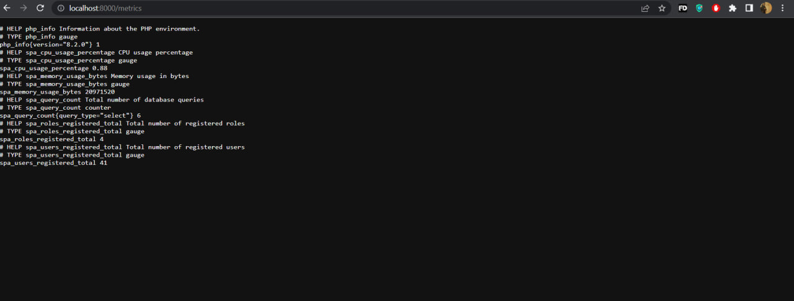
    
</details>

<details>
  <summary><h2>Prometheus</h2></summary>

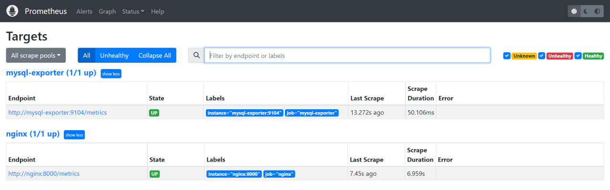
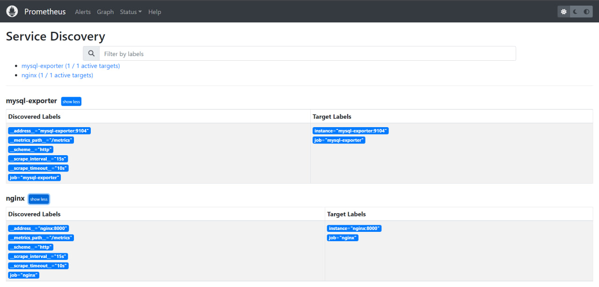
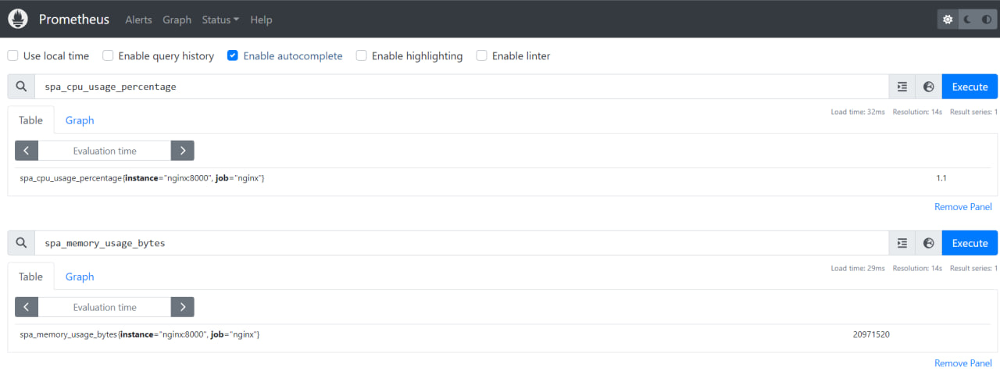
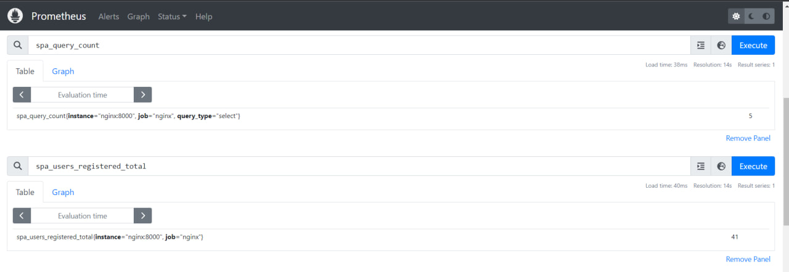
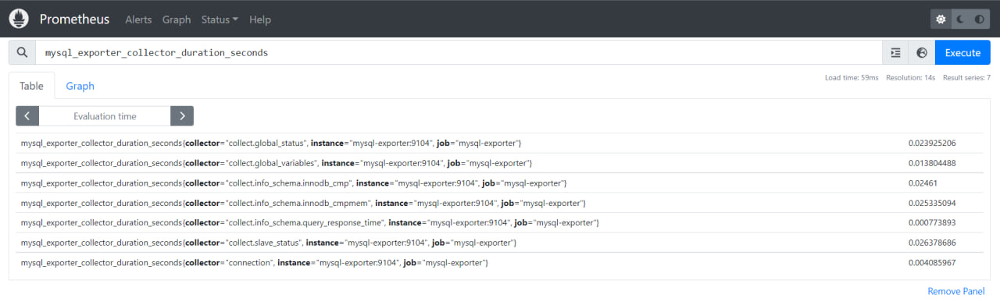
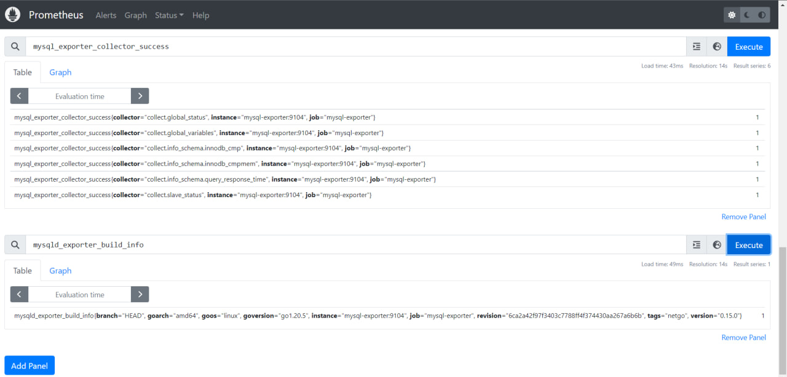
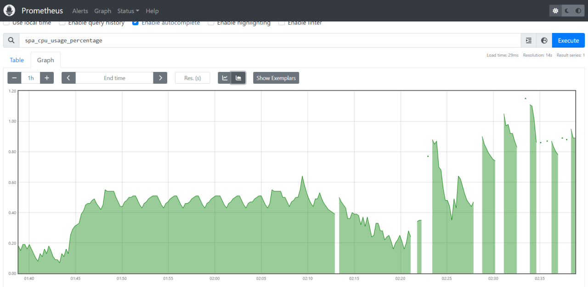
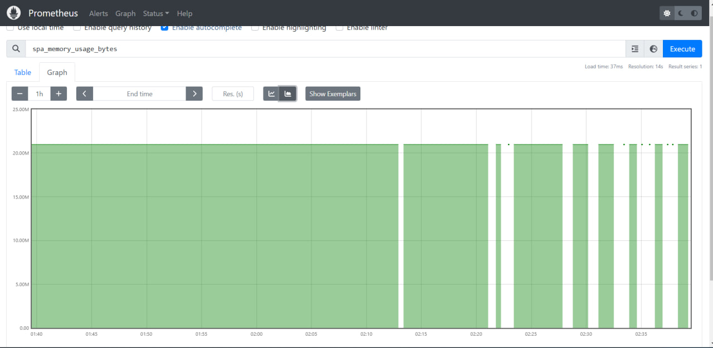
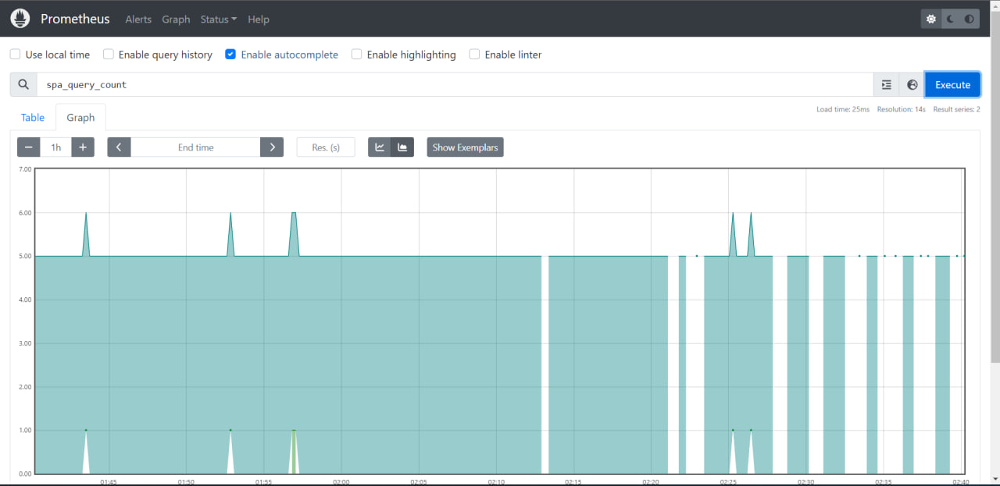
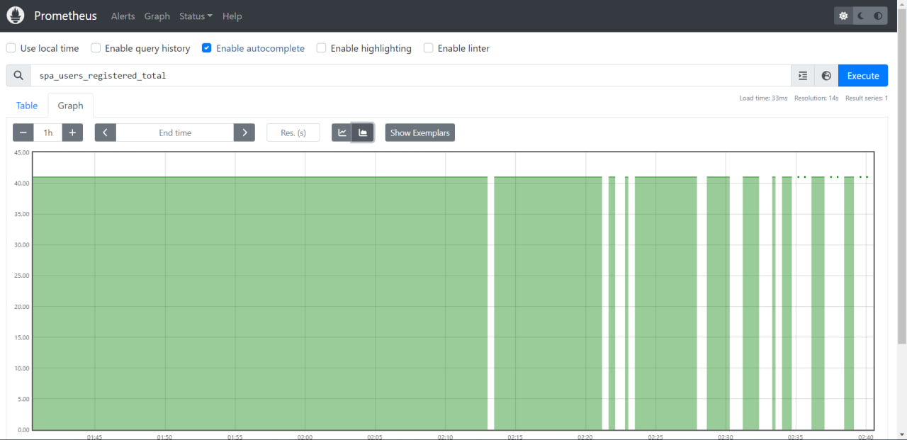
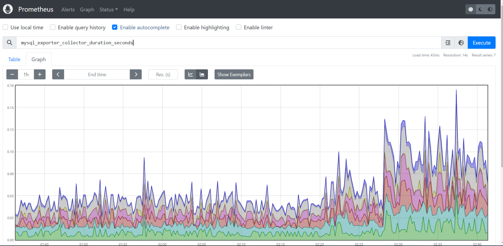


</details>

<details>
  <summary><h2>Mysql-exporter </h2></summary>
    
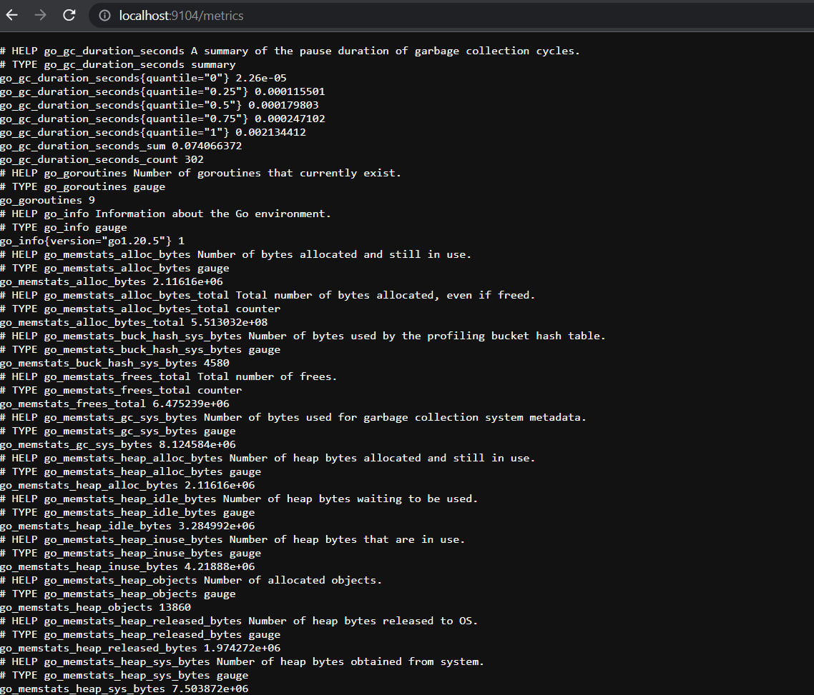
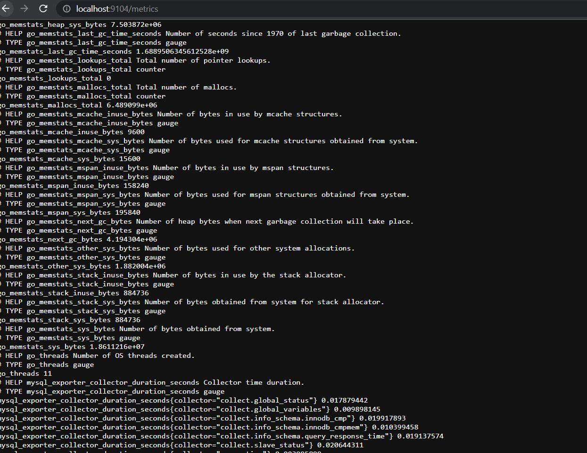
</details>

<details>
  <summary><h2>Grafana</h2></summary>
    
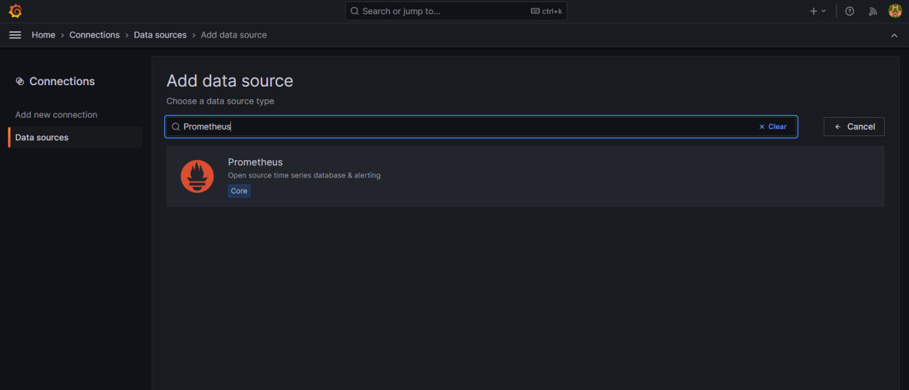
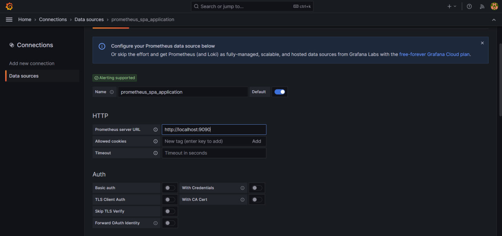
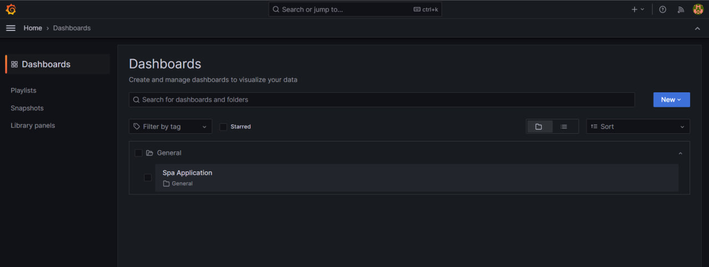
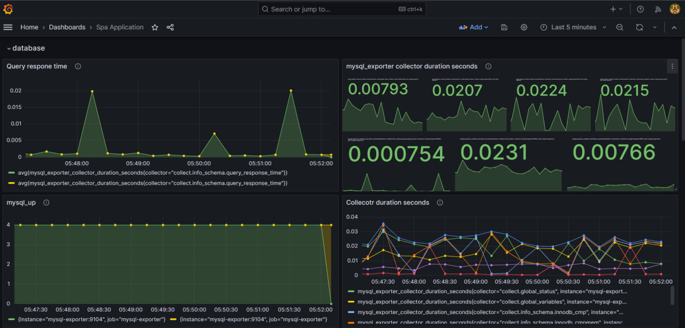
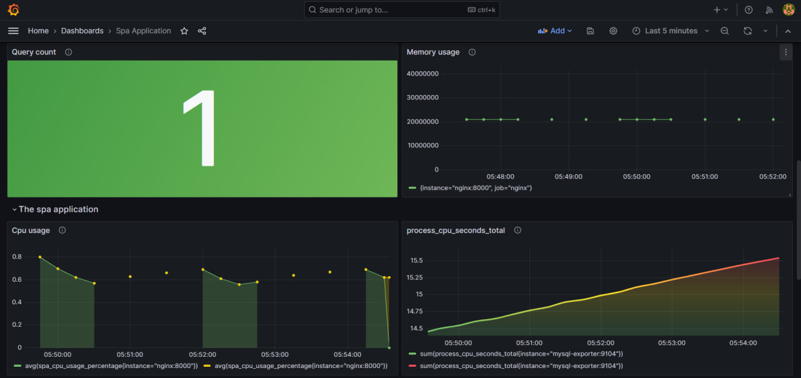
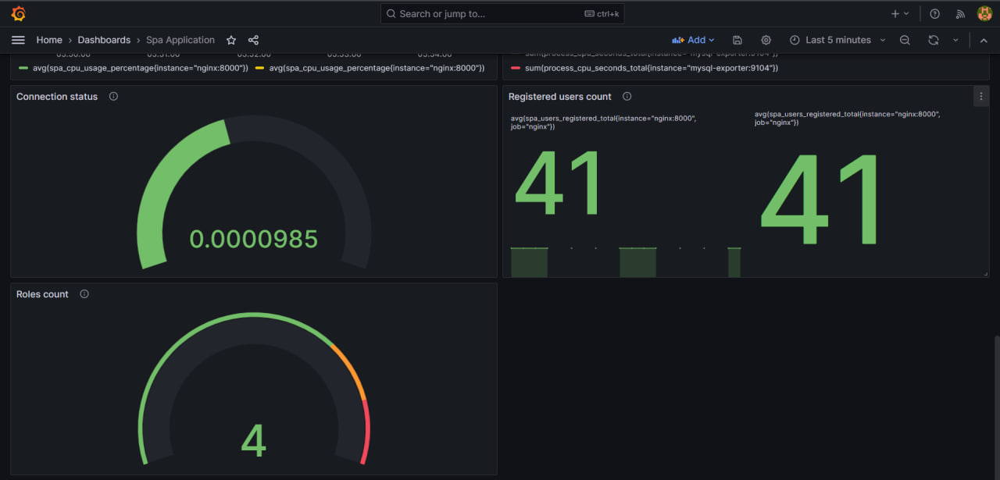
</details>

